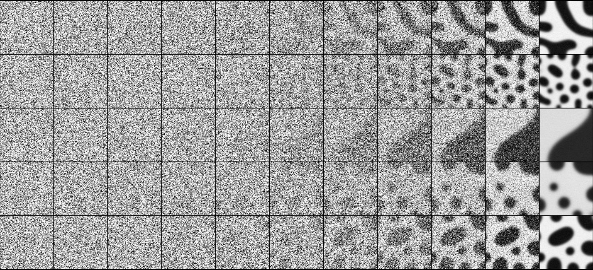

# Generative Design of Material Microstructures for Organic Solar Cells using Diffusion Models

## Overview

This work presents a diffusion model for generating two-phase microstructures for organic solar cells. The proposed method demonstrates improved performance over previous approaches in producing realistic microstructures while effectively capturing the diversity of the target distribution.

## Trajectory Visualizations

